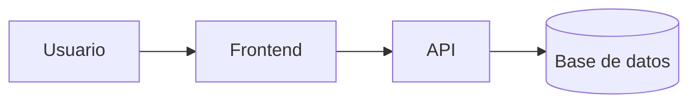

# Laboratorio README


Proyecto de práctica para aprender Markdown avanzado en GitHub.
Este repositorio muestra el uso de tablas, listas, badges, enlaces internos y diagramas Mermaid.

## Tabla de contenidos

- [Descripción](#descripción)
- [Instalación](#instalación)
- [Uso](#uso)
- [Estado de funcionalidades](#estado-de-funcionalidades)
- [Pendientes](#pendientes)
- [Arquitectura](#arquitectura)
- [Contribuidores](#contribuidores)

## Descripción

Este repositorio documenta paso a paso mi aprendizaje de Markdown.
Incluye ejemplos de tablas, listas de tareas, badges y diagramas.

## Instalación

```bash
git clone https://github.com/ov219771-svg/laboratorio-readme.git
cd laboratorio-readme
```

## Uso

```bash
code .
```

Abre el archivo README.md y revisa su contenido renderizado en GitHub.

## Estado de funcionalidades

| Función | Estado |
|---|---|
| Login | Listo |
| Reportes | En progreso |

## Pendientes

- [x] Diseño de la base de datos
- [ ] Pruebas unitarias

## Arquitectura



## Contribuidores

- Oscar Villar - GitHub: **ov219771-svg**